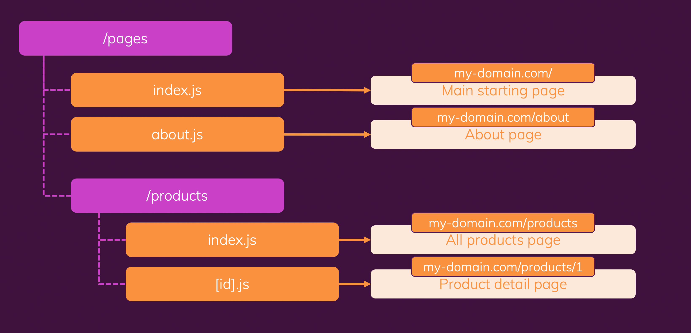

# Fluenty Web App

Fluenty web-site built in Next.js with React + Vite.

## Table of Contents
- [Getting Started](#getting-started)
    - [Prerequisites](#prerequisites)
    - [Installation](#installation)
- [Usage](#usage)
- [Folder Structure](#folder-structure)
- [Features](#features)
- [Contributing](#contributing)
- [License](#license)
- [Learn More](#learn-more)
    - [Next.js](#nextjs)
    - [React + Vite](#react+vite)
    - [Deploy](#deploy)
         - [Deployment Steps & Considerationsl](#deploymentsteps&considerations)
         - [on Vercel](#deployonvercel)
- [Acknowledgments](#acknowledgments)

## Getting Started

### Prerequisites

Make sure you have Node.js and npm installed.
```
Node Version: 20.10.0
```
```
Next-Auth Version: ^4.
```

### Installation

1. Clone the repository
```bash
git clone https://git@github.com:<your-GitHub-username >/fluenty-web-app.git
```
2. Change to your project directory
```bash
cd your-project
```
3. Run npm install
```bash
npm install
```
4. Run development server
```bash
npm run dev
```
5. Open it up to see the results 
```
Open [http://localhost:3000]
(http://localhost:3000) 
with your browser to see the result.
```
5. Now you are ready to start developing
```
You can start editing
 the page by modifying `pages/page.js`. 
 The page auto-updates as you edit the file.
```

## Usage

Explain how to use your project. Provide examples if necessary.

## Folder Structure

1. Always Make A Comment to make less code is the page directory.
2. We are using the .module.css for style components



your-project/

│

├── pages/

│   ├── page.js

│   ├── about

│   │   ├── page.js

│   │   └── [id].js

│   ├── [id]

│   │   ├── [...id].js

│   │   └── [id].js

│   └── ...

│

├── components/

│   ├── Header

│   │   ├── Header.js

│   │   └── Header.module.css

│   ├── Footer

│   │   ├── Footer.js

│   │   └── Footer.module.css

│   └── ...

│

└── ...

## Features

List the key features of your project.

## Contributing

Writing code:
1. Use camelCase.
2. Components have Uppercase starting letter in files & directory.
3. Using Next-Auth version ^4.

Creating a new branch flow:
1. Pull main 
2. Create a new branch of main
3. Make changes and commit
4. Push to the branch
5. Open a pull request

OR

Working branch flow:
1. Pull on main (When Pull Requesy is merge to main)
2. Checkout to your branch
3. Git pull on your branch
4. Git merge main into your branch
5. Make changes and commit
6. Push to the branch
7. If you have not made a Pull Request then Open a pull request


## License

This project is licensed under the [Your License] - see the LICENSE.md file for details.

## Learn More

### Next.js

This is a [Next.js](https://nextjs.org/) project bootstrapped with [`create-next-app`](https://github.com/vercel/next.js/tree/canary/packages/create-next-app).

To learn more about Next.js, take a look at the following resources:

- [Next.js Documentation](https://nextjs.org/docs) - learn about Next.js features and API.
- [Learn Next.js](https://nextjs.org/learn) - an interactive Next.js tutorial.

You can check out [the Next.js GitHub repository](https://github.com/vercel/next.js/) - your feedback and contributions are welcome!

### React + Vite

This template provides a minimal setup to get React working in Vite with HMR and some ESLint rules.

Currently, two official plugins are available:

- [@vitejs/plugin-react](https://github.com/vitejs/vite-plugin-react/blob/main/packages/plugin-react/README.md) uses [Babel](https://babeljs.io/) for Fast Refresh
- [@vitejs/plugin-react-swc](https://github.com/vitejs/vite-plugin-react-swc) uses [SWC](https://swc.rs/) for Fast Refresh


### Deploy 

Adding gitHub Actions for deployments.
....
role-to-assume: ${{ secrets.<deploymentRole> || nameOfRole }}

Use standard build deploy, NOT Full Static Build.

#### Deployment Steps & Considerations
1. Add page metadata, optimize code, remove unnecessary dependencies
2. Use environment variables for variable data (e.g. database credentials, API keys, ...)
3. Do a test build and test the production-ready app locally or on some test server
4. Deploy

#### on Vercel
The easiest way to deploy your Next.js app is to use the [Vercel Platform](https://vercel.com/new?utm_medium=default-template&filter=next.js&utm_source=create-next-app&utm_campaign=create-next-app-readme) from the creators of Next.js.

Check out our [Next.js deployment documentation](https://nextjs.org/docs/deployment) for more details.

## Acknowledgments

Thank you for your contribution to help build the web-site:

Vincent van Wyk,
Founder Fluenty

Terri Ogden,
COO Fleunty

